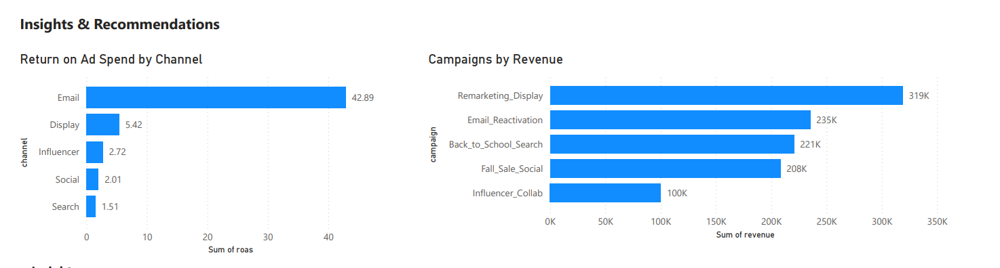

# Marketing Campaign Effectiveness Analysis (Power BI)

## Overview
Analyzed hypothetical marketing campaign data to identify which campaigns and channels drive higher revenue and conversions.

## Tools
- Power BI
- Excel/CSV

## What’s included
- `powerbi/` Power BI dashboard (.pbix)
- `reports/` PDF export of dashboard
- `data/` synthetic datasets used
- `assets/` screenshots

## Key Metrics
- ROAS (Revenue / Spend)
- CVR (Conversions / Visitors)
- CPA (Spend / Conversions)

## Dashboard

